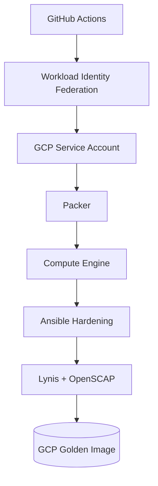
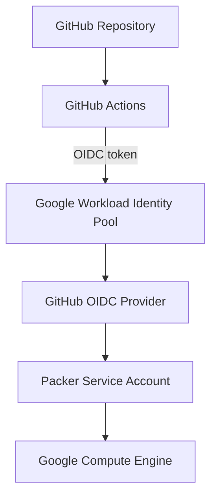
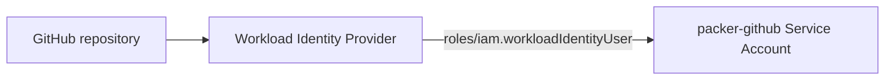
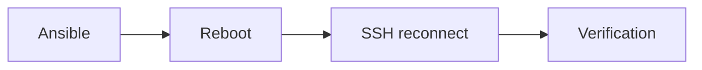
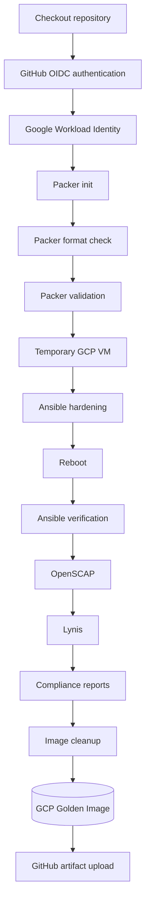

<div align="center">

# ☁️ Google Cloud Golden Image

### Ubuntu 24.04 · Packer · Ansible · GitHub Actions · Workload Identity Federation


</div>

---

## Overview

This directory contains the Packer configuration used to build the hardened Ubuntu 24.04 Golden Image on **Google Cloud Platform**. The authentication architecture does **not** require a long-lived Google service account JSON key.



---

## Authentication Architecture



---

## Prerequisites

Before running the GCP pipeline, the following must exist:

- Google Cloud project with Compute Engine enabled
- Dedicated Packer service account
- Workload Identity Pool + GitHub OIDC Provider
- GitHub → Service Account IAM binding
- Required GCP APIs and IAM roles
- GitHub repository variables

---

## Required Google APIs

```bash
PROJECT_ID="YOUR_GCP_PROJECT_ID"

gcloud services enable \
  compute.googleapis.com \
  iamcredentials.googleapis.com \
  cloudresourcemanager.googleapis.com \
  --project="$PROJECT_ID"
```

Verify:

```bash
gcloud services list \
  --project="$PROJECT_ID" \
  --enabled \
  --filter="config.name:(compute.googleapis.com OR iamcredentials.googleapis.com OR cloudresourcemanager.googleapis.com)" \
  --format="table(config.name)"
```

Expected: `cloudresourcemanager.googleapis.com`, `compute.googleapis.com`, `iamcredentials.googleapis.com`.

---

## Packer Service Account

```bash
gcloud iam service-accounts create packer-github \
  --project="$PROJECT_ID" \
  --display-name="GitHub Packer Service Account"

SA="packer-github@${PROJECT_ID}.iam.gserviceaccount.com"
```

---

## IAM Roles

The service account requires:

```text
roles/compute.instanceAdmin.v1
roles/iam.serviceAccountUser
```

```bash
gcloud projects add-iam-policy-binding "$PROJECT_ID" \
  --member="serviceAccount:${SA}" \
  --role="roles/compute.instanceAdmin.v1"

gcloud projects add-iam-policy-binding "$PROJECT_ID" \
  --member="serviceAccount:${SA}" \
  --role="roles/iam.serviceAccountUser"
```

When IAP SSH tunneling is enabled, also add `roles/iap.tunnelResourceAccessor`.

Verify:

```bash
gcloud projects get-iam-policy "$PROJECT_ID" \
  --flatten="bindings[].members" \
  --filter="bindings.members:serviceAccount:${SA}" \
  --format="table(bindings.role)"
```

---

## Workload Identity Federation

GitHub Actions authenticates to Google Cloud using GitHub's OIDC identity — no service account JSON key and no permanent GCP credential stored in GitHub. Instead: short-lived authentication via GitHub OIDC + Workload Identity Federation.

### Create the Workload Identity Pool

```bash
gcloud iam workload-identity-pools create github-pool \
  --project="$PROJECT_ID" \
  --location="global" \
  --display-name="GitHub Actions Pool"

PROJECT_NUMBER="$(gcloud projects describe "$PROJECT_ID" --format="value(projectNumber)")"
```

### Create the GitHub Provider

```bash
gcloud iam workload-identity-pools providers create-oidc github-provider \
  --project="$PROJECT_ID" \
  --location="global" \
  --workload-identity-pool="github-pool" \
  --display-name="GitHub Provider" \
  --issuer-uri="https://token.actions.githubusercontent.com" \
  --attribute-mapping="google.subject=assertion.sub,attribute.repository=assertion.repository"
```

The provider should be restricted to the expected GitHub repository.

### Allow GitHub to Use the Service Account

The GitHub identity must receive `roles/iam.workloadIdentityUser` on the Packer service account, with the binding restricted to the intended repository:



### Get the Provider Identifier

```bash
gcloud iam workload-identity-pools providers describe github-provider \
  --project="$PROJECT_ID" \
  --location="global" \
  --workload-identity-pool="github-pool" \
  --format="value(name)"
```

Result format:

```text
projects/PROJECT_NUMBER/locations/global/workloadIdentityPools/github-pool/providers/github-provider
```

Store this full value in GitHub as `GCP_WORKLOAD_IDENTITY_PROVIDER`.

---

## GitHub Repository Variables

Settings → Secrets and variables → Actions → Variables:

| Variable | Purpose |
|---|---|
| `GCP_PROJECT_ID` | Target GCP project |
| `GCP_ZONE` | Temporary Packer VM zone |
| `GCP_PACKER_SERVICE_ACCOUNT` | Service account used by GitHub Actions |
| `GCP_WORKLOAD_IDENTITY_PROVIDER` | Complete Workload Identity Provider identifier |

These are configuration identifiers, not long-lived authentication secrets. Referenced in workflows as `${{ vars.GCP_PROJECT_ID }}`, `${{ vars.GCP_ZONE }}`, `${{ vars.GCP_PACKER_SERVICE_ACCOUNT }}`, `${{ vars.GCP_WORKLOAD_IDENTITY_PROVIDER }}`.

---

## GitHub OIDC Permission & Authentication Step

```yaml
permissions:
  contents: read
  id-token: write   # required to obtain the GitHub OIDC token for Workload Identity Federation

steps:
  - name: Authenticate to Google Cloud
    id: auth
    uses: google-github-actions/auth@v3
    with:
      workload_identity_provider: ${{ vars.GCP_WORKLOAD_IDENTITY_PROVIDER }}
      service_account: ${{ vars.GCP_PACKER_SERVICE_ACCOUNT }}

  - name: Setup Google Cloud CLI
    uses: google-github-actions/setup-gcloud@v3
```

---

## Packer Environment Variables

The workflow maps GitHub configuration to Packer:

```yaml
env:
  PKR_VAR_project_id: ${{ vars.GCP_PROJECT_ID }}
  PKR_VAR_zone: ${{ vars.GCP_ZONE }}
```

Packer automatically maps `PKR_VAR_project_id → var.project_id` and `PKR_VAR_zone → var.zone`.

---

## Packer Build Configuration

```hcl
source_image_family      = "ubuntu-2404-lts-amd64"
source_image_project_id  = ["ubuntu-os-cloud"]

machine_type = "e2-medium"
disk_size    = 20
disk_type    = "pd-balanced"
```

Resulting image naming convention: `ubuntu-2404-golden-YYYYMMDD-HHMMSS`.

## SSH Connectivity

The current build can use IAP instead of a temporary external IP: `use_iap = true`.

---

## Ansible Hardening

Packer executes the common hardening playbook `ansible/site.yml`. Cloud-specific variables disable configuration that is inappropriate for a cloud image:

```text
packages_full_upgrade_enabled=true
grub_hardening_enabled=false
grub_password_enabled=false
mount_hardening_separate_filesystems_enabled=false
time_sync_backend=chrony
```

This allows the same Ansible roles to support multiple platforms.

---

## Reboot & Verification



If the VM fails to reconnect, the Packer build fails.

Packer then executes `ansible/tests/verify.yml` with `ansible/tests/vars/cloud.yml` and `image_platform=cloud`.

---

## OpenSCAP & Lynis

The OpenSCAP datastream `compliance/openscap/ssg-ubuntu2404-ds.xml` is copied to the temporary VM and evaluated via `compliance/openscap/check-compliance.sh`, producing `openscap-results.xml` and `openscap-report.html`.

Lynis validation runs via `compliance/lynis/check-score.sh`. Current minimum score: **88**. The build fails if the required score is not reached.

---

## Compliance Reports

Reports are generated on the temporary VM under `/tmp/golden-image-validation/` and downloaded by Packer into `packer/gcp/reports/golden-image-validation/`:

```text
golden-image-validation/
├── lynis/
└── openscap/
    ├── openscap-results.xml
    └── openscap-report.html
```

GitHub Actions uploads the reports as workflow artifacts.

---

## Image Cleanup

Before the final image is created, Packer executes `scripts/cleanup-image.sh`, preparing the VM for use as a reusable Golden Image.

---

## Local GCP Build

```bash
gcloud auth list
gcloud config set project YOUR_GCP_PROJECT_ID

export PKR_VAR_project_id="YOUR_GCP_PROJECT_ID"
export PKR_VAR_zone="europe-west1-b"

cd packer/gcp
packer init .
packer fmt -recursive .
packer fmt -check -recursive .
packer validate .
packer build .
```

---

## GitHub Actions Build

Workflow: `.github/workflows/gcp-golden-image.yml`. Run manually via GitHub → Actions → GCP Golden Image Build → Run workflow.



---

## Verify the Image

```bash
gcloud compute images list \
  --project="YOUR_GCP_PROJECT_ID" \
  --filter="name~'^ubuntu-2404-golden-'" \
  --sort-by=~creationTimestamp
```

---

## Troubleshooting

| Issue | Fix |
|---|---|
| `Cloud Resource Manager API has not been used or it is disabled` | `gcloud services enable cloudresourcemanager.googleapis.com --project="$PROJECT_ID"` |
| Authentication check | `gcloud auth list` then `gcloud projects describe "$PROJECT_ID"` |
| Check service account roles | `gcloud projects get-iam-policy "$PROJECT_ID" --flatten="bindings[].members" --filter="bindings.members:serviceAccount:${SA}" --format="table(bindings.role)"` |
| Packer formatting failure | `packer fmt -recursive .` then `packer fmt -check -recursive .` |

---
## Related Documentation

- [Main Project README](../../README.md)
- [VirtualBox Golden Image](../virtualbox/README.md)

---

<div align="center">

### 🔐 Keyless authentication. Automated hardening. Validated cloud images.

</div>
