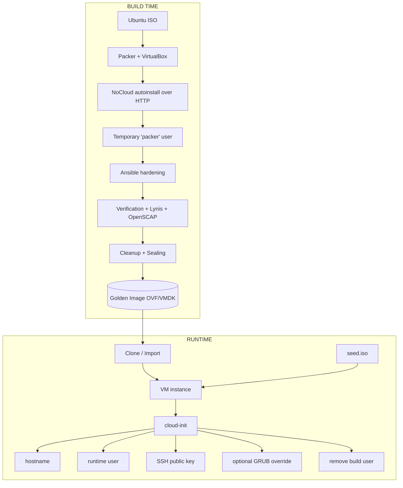
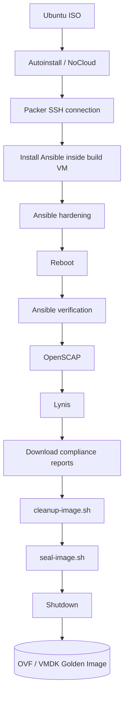
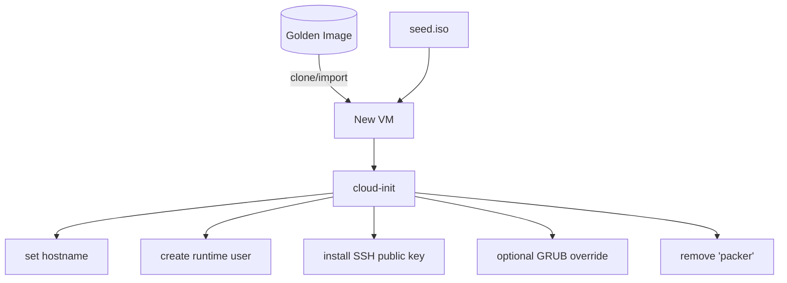

<div align="center">

# VirtualBox Golden Image

### Ubuntu 24.04 · Packer · Ansible · VirtualBox


</div>

---

## Overview

This repository builds a **hardened Ubuntu 24.04 Golden Image** for VirtualBox, and provides a separate runtime provisioning mechanism for creating unique VM instances from that image.

The design intentionally separates:

1. **Build time** — Packer installs Ubuntu, applies Ansible hardening, runs compliance checks, cleans up and seals the image.
2. **Instance runtime** — a per-instance NoCloud `seed.iso` provides hostname, runtime user, SSH key and optional GRUB credentials.



---

## Repository Layout

```text
packer/
├── common/http/{user-data, meta-data}
└── virtualbox/
    ├── ubuntu.pkr.hcl
    ├── variables.pkr.hcl
    ├── ubuntu.auto.pkrvars.hcl.example
    ├── scripts/{create-instance.ps1, create-instance.sh, preflight-check.ps1}
    └── instances/            # generated locally

scripts/{cleanup-image.sh, seal-image.sh}
compliance/{lynis/, openscap/}
```

---

# 1. Golden Image Build

## Build-Time NoCloud Configuration

Packer starts a temporary HTTP server serving `packer/common/http/` and boots Ubuntu with:

```text
ds=nocloud;s=http://<PACKER_HTTP_SERVER>/
```

This build-time `user-data` creates the temporary `packer` account and installs the SSH public key required by Packer. This is **distinct** from the per-instance `seed.iso` (see section 4).

## Build Pipeline



`seal-image.sh` performs final image sanitization:
- removes the build SSH authorization
- locks the `packer` account (`nologin`)
- cleans cloud-init state
- resets the `machine-id`
- removes SSH host keys
- removes the system random seed
- clears build history and temporary files
- shuts the VM down before the final artifact is produced

The `packer` account is disabled in the Golden Image and removed by cloud-init at runtime provisioning.

---

# 2. Local Build

## Prerequisites

```bash
git --version
packer version
VBoxManage --version
```

Ansible does not need to be installed on the host — Packer installs it inside the build VM via `ansible-local`.

## Clone & Configure

```bash
git clone https://github.com/Yasserkdr1/golden-image_factory.git
cd golden-image_factory/packer/virtualbox
cp ubuntu.auto.pkrvars.hcl.example ubuntu.auto.pkrvars.hcl
```

Example:

```hcl
iso_url      = "file:///absolute/path/to/ubuntu-24.04.4-live-server-amd64.iso"
iso_checksum = "sha256:YOUR_SHA256_CHECKSUM"

ssh_username         = "packer"
ssh_password         = "YOUR_BUILD_PASSWORD"
ssh_private_key_file = "/absolute/path/to/build_private_key"

grub_password_hash = "grub.pbkdf2.sha512.10000.YOUR_HASH"

vm_name  = "ubuntu-24.04-golden-test"
headless = false
```

> `ubuntu.auto.pkrvars.hcl` is local config and must **never** be committed. The private SSH key must match the public key in `packer/common/http/user-data`, and the build password must match the configured hash.

## Validate & Build

```bash
packer init .
packer fmt -recursive .
packer fmt -check -recursive .
packer validate .
packer build .
```

- Generated images → `packer/virtualbox/output-ubuntu/`
- Compliance reports → `packer/virtualbox/reports/`

---

# 3. GitHub Actions Build

Windows workflow: `.github/workflows/build-virtualbox-windows.yml`, running on a `self-hosted windows x64` runner. Packer and VirtualBox are native on the runner; Ansible runs inside the temporary Ubuntu build VM.

## Secrets (Settings → Secrets and variables → Actions → Secrets)

| Secret | Purpose |
|---|---|
| `PACKER_SSH_PRIVATE_KEY` | Private key matching the build public key |
| `PACKER_SSH_PASSWORD` | Temporary build user's sudo password |
| `GRUB_PASSWORD_HASH` | GRUB PBKDF2 SHA-512 hash |

The workflow writes the private key only to a temporary runner file and removes it in an `always()` cleanup step.

## Variables

| Variable | Purpose |
|---|---|
| `UBUNTU_ISO_URL_WINDOWS` | Ubuntu ISO path/URL accessible from the Windows runner |
| `UBUNTU_ISO_CHECKSUM` | SHA-256 checksum in Packer format |

## Workflow Inputs

| Input | Purpose |
|---|---|
| `release_version` | Release version (e.g. `v1.0.0`) |
| `publish_release` | Publish a GitHub Release after successful validation |
| `upload_image_artifact` | Upload the raw OVF/VMDK as a temporary Actions artifact |

---

# 4. Runtime Instance Provisioning

The Golden Image holds no final runtime identity. Each VM gets its configuration through a unique NoCloud `seed.iso`, generated by `create-instance.ps1` (launches the Bash script via WSL) or `create-instance.sh`.

## WSL Prerequisites

```bash
sudo apt update
sudo apt install -y openssl openssh-client cloud-image-utils
sudo apt install -y grub-common   # for per-instance GRUB overrides
```

## Generating a Seed

```powershell
.\packer\virtualbox\scripts\create-instance.ps1
```

The script asks for: instance name, hostname, runtime Linux user, runtime password, GRUB config, SSH config (generate a new ED25519 key pair or reuse an existing public key). The plaintext password is never written to the seed — a SHA-512 hash is generated instead. If a new private key is generated on a Windows-mounted filesystem, restrictive Windows ACLs are applied.

## Generated Files (example `VM2`)

```text
packer/virtualbox/instances/VM2/
├── user-data
├── meta-data
├── seed.iso
├── id_VM2          # only if a new key pair was generated
└── id_VM2.pub
```

**`user-data`**: runtime Linux user, password hash, sudo membership, SSH public key, optional GRUB credentials, first-boot commands. `ssh_pwauth: false` (SSH password auth disabled). At the end of first-boot provisioning, cloud-init runs `userdel -r packer`.

**`meta-data`**: unique cloud-init identity and hostname —

```yaml
instance-id: <instance-name>-<unique-uuid>
local-hostname: <hostname>
```

The unique `instance-id` ensures cloud-init treats each VM as a distinct instance.

**`seed.iso`**: a small NoCloud/CIDATA configuration disk (`user-data` + `meta-data`). Contains **neither** Ubuntu nor the Golden Image. Specific to one instance — must not be reused as a generic image artifact.

---

# 5. Using `seed.iso`



Steps:
1. Import or clone the Golden Image.
2. Attach the generated `seed.iso` as an optical disk.
3. Boot the VM — cloud-init detects the NoCloud seed and applies the config.
4. Connect with the generated/selected SSH key: `ssh -i id_VM2 <username>@<VM-IP>`

The Golden Image is sealed with `cloud-init clean`, so every new VM consumes fresh NoCloud metadata on first boot. The seed ISO can be detached once the runtime config is verified.

---

# 6. Build-Time Seed vs Runtime Seed

| Stage | Source | Purpose |
|---|---|---|
| Golden Image build | `packer/common/http/user-data` | Autoinstall Ubuntu + create the temporary `packer` identity |
| Runtime instance | `instances/<name>/seed.iso` | Final instance identity and configuration |

No runtime user or runtime private key is baked into the Golden Image.

---

# 7. Security

**Never commit:** `ubuntu.auto.pkrvars.hcl`, `.env`, private SSH keys, runtime seed files, runtime password hashes, GRUB password hashes, temporary runner credentials.

The `packer/virtualbox/instances/` folder should stay local — `.gitignore`:

```gitignore
packer/virtualbox/instances/
```

Check before committing: `git status`. The repo also includes `.gitleaks.toml` for secret scanning.

---

# 8. Troubleshooting

| Issue | Check |
|---|---|
| Packer formatting fails | `packer fmt -recursive .` then `packer fmt -check -recursive .` |
| ISO not found | `ls -lh /path/to/ubuntu.iso` — verify it's accessible from the Packer machine |
| Runtime user not created | Confirm `seed.iso` was attached **before** first boot; `cloud-init status --long`; `lsblk -f` to see the NoCloud disk |
| cloud-init doesn't re-run | Runtime provisioning needs a fresh clone/import with a unique `instance-id` — generate a new seed via `create-instance.ps1` |
| SSH connection fails | `ip addr`, `sudo systemctl status ssh`, check `/home/<runtime-user>/.ssh/authorized_keys` |

---

# Related Documentation

- [Main Project README](../../README.md)
- [Google Cloud Golden Image](../gcp/README.md)

---

<div align="center">

### Build once. Seal once. Provision unique instances at runtime.

</div>
